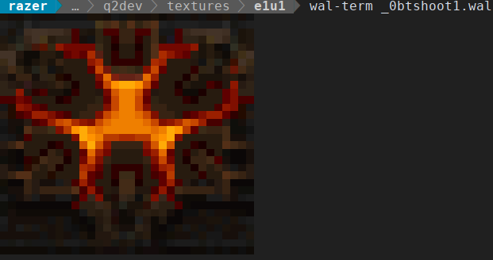

# wal-tools

This repository contains command-line tools to work with .WAL texture files
(found in games based on Quake 2 engine). Supports both vanilla Quake 2 textures
and Daikatana variations.

These tools have been tested only on Linux, but compilation and usage on Windows
through MinGW/Cygwin should be possible (needs to be checked though).

## wal-term
Displays specified texture right in your terminal with some ANSI escape code
trickery.

Usage:
```
wal-term texture.wal
```

Screenshot:



## wal-info
Prints out information about a WAL file.

Usage:
```
$ wal-info texture.wal
```

Example output:
```
$ wal-info tests/clip.wal 
Type: Quake 2
Name: e1u1/clip
Width: 32
Height: 32
MIP 0 offset: 0x00000064
MIP 1 offset: 0x00000464
MIP 2 offset: 0x00000564
MIP 3 offset: 0x000005a4
Next frame name: 
Flags: 0x00000080
Contents: 0x00030000
Value: 0000000000
```

## wal-edit
Allows editing values embedded in WAL header.

Usage:
```
wal-edit FILENAME [-key value]

wal-edit - edit the WAL texture header data
Options:
-name SAMPLE - sets the name to 'SAMPLE' (max 32 chars)
-animname SAMPLE2 - sets the next animation frame name to 'SAMPLE2' (max 32 chars)
-flags 0x1337 - sets the flags field to 0x1337 (32-bit number)
-contents 100 - sets the contents field to 100 (32-bit number)
-value 100 - sets the value field to 100 (32-bit number)
```


## wal-export
Exports specified WAL texture to TGAs.

Usage:
```
wal-export FILENAME [-mip N] [-o FILENAME_WITHOUT_EXT]

wal-export - exports WAL textures to the specified format.
Supported formats: TGA (default)
Options:
	-mip N: export mip N only (Quake 2 - [0..3], Daikatana - [0..8]
	-o FILE: export to specified filename (extension and mip N is added)
Output filename is constructed as follows (for example):
source.wal -> source-mip-0.tga
If -mip is specified, it's omitted from output filename:
source.wal -> source.tga

```

## wal-convert
Creates a WAL texture from specified TGA file. Mipmaps are generated automatically.

Usage:
```
wal-convert FILENAME [-o FILENAME_WITHOUT_EXT]

wal-convert - converts image file to a WAL texture.
Supported formats: TGA with 256-color 24bpp RGB palette (default)
Options:
	-o FILE: export to specified filename (.wal is added automatically)
	-f FORMAT: 'Q2' or 'DK' (defaults to 'Q2')
```

Further changes like setting names, flags and other stuff should be done
through the **wal-edit** tool.